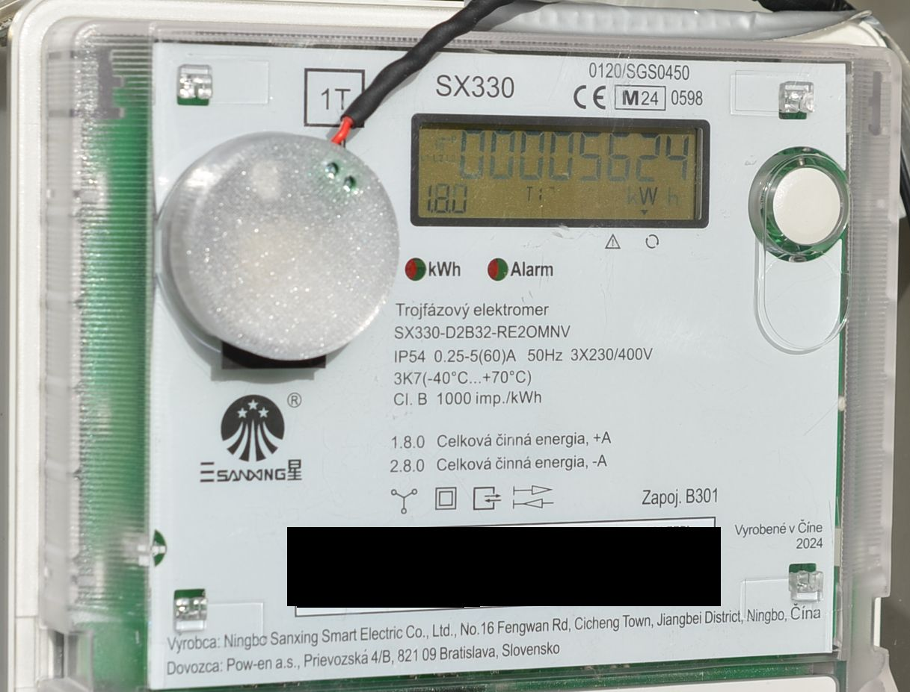
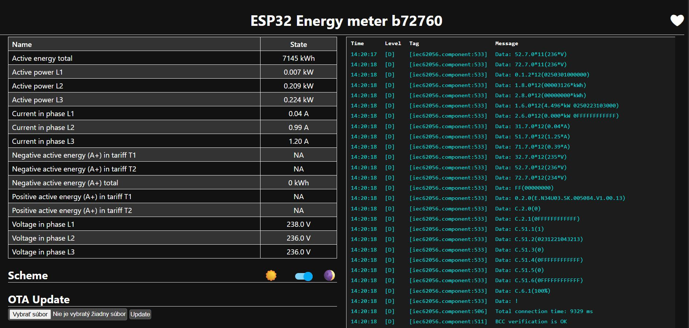

  
  

# WOH-01
Optical WiFi reader with ESPHome
Optical WiFi head for IEC62056-21 compatible electrical meter with ESPHome WOH-01

The WiFi optical head (sometimes referred as optical probe) is a wireless device
capable to read data from energy meters equipped with optical IEC62056-21
compatible meters. https://en.wikipedia.org/wiki/IEC_62056

Technical parameters of WOH-01:
- Power supply – 5 to 7.5VDC
- Power consumption – max 650mW/150mA
- Working frequency – WiFi 2.4GHz
- Works with http browser or Home Assistant API
- Data update frequency – every 30s
- Dimensions – Φ36x16mm
- Magnetic holder

### Data read from electricity meter

  
  

  - [ESPHome Configuration File](energy-meter.yaml)

### Purchase:
For purchasing information, please visit our [Product Page](https://www.soselectronic.com/sk-sk/products/sos-electronic/woh-01-432822).
